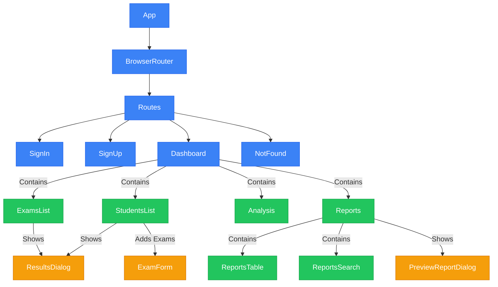
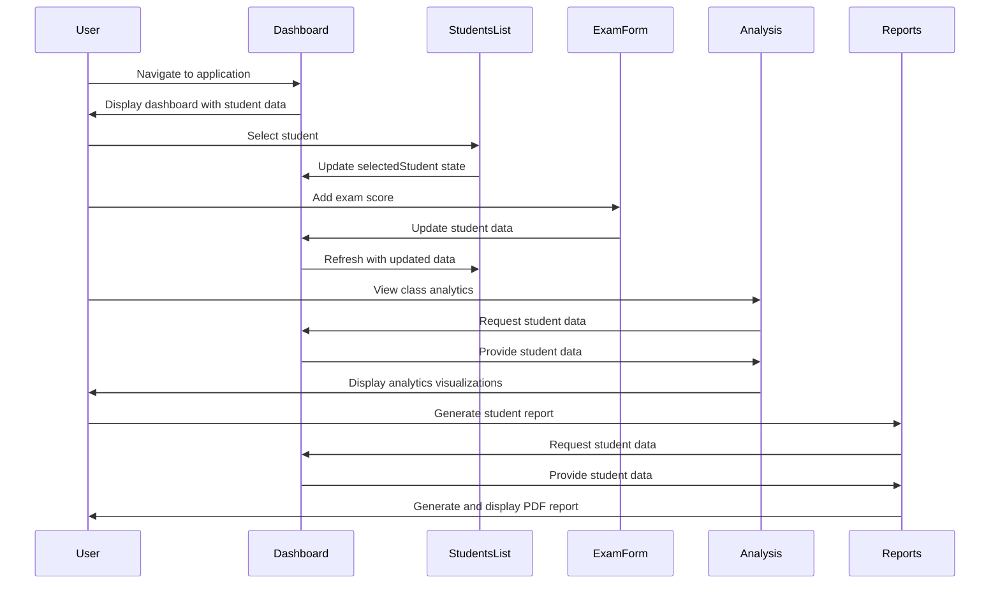
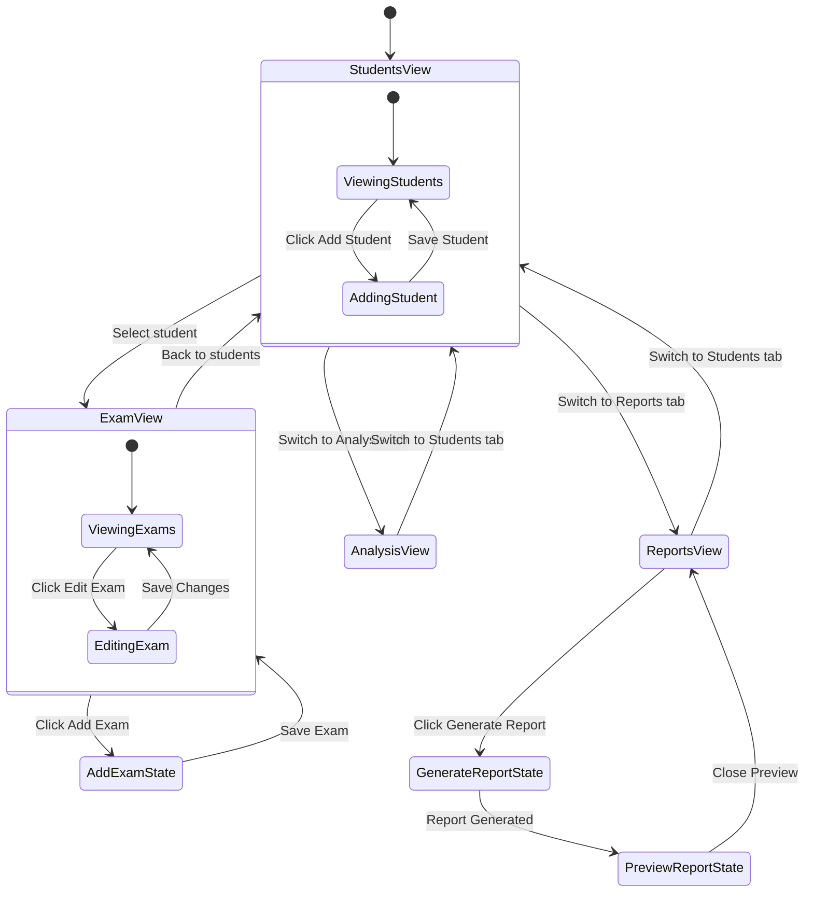

# Component Interactions

This document outlines how the different components in InsightEd interact with each other.

## Component Hierarchy

```mermaid
graph TD
    App[App] --> BR[BrowserRouter]
    BR --> Routes
    Routes --> SignIn
    Routes --> SignUp
    Routes --> Dashboard
    Routes --> NotFound
    
    Dashboard --> |Contains| StudentsList
    Dashboard --> |Contains| ExamsList
    Dashboard --> |Contains| Analysis
    Dashboard --> |Contains| Reports
    
    StudentsList --> |Shows| ResultsDialog
    StudentsList --> |Adds Exams| ExamForm
    
    ExamsList --> |Shows| ResultsDialog
    
    Reports --> |Contains| ReportsTable
    Reports --> |Contains| ReportsSearch
    Reports --> |Shows| PreviewReportDialog
    
    classDef page fill:#3b82f6,stroke:#2563eb,color:white;
    classDef component fill:#22c55e,stroke:#16a34a,color:white;
    classDef dialog fill:#f59e0b,stroke:#d97706,color:white;
    
    class App,BR,Routes,Dashboard,SignIn,SignUp,NotFound page
    class StudentsList,ExamsList,Analysis,Reports,ReportsTable,ReportsSearch component
    class ResultsDialog,ExamForm,PreviewReportDialog dialog
```

## Component Data Flow

```mermaid
sequenceDiagram
    participant User
    participant Dashboard
    participant StudentsList
    participant ExamForm
    participant Analysis
    participant Reports
    
    User->>Dashboard: Navigate to application
    Dashboard->>User: Display dashboard with student data
    
    User->>StudentsList: Select student
    StudentsList->>Dashboard: Update selectedStudent state
    
    User->>ExamForm: Add exam score
    ExamForm->>Dashboard: Update student data
    Dashboard->>StudentsList: Refresh with updated data
    
    User->>Analysis: View class analytics
    Analysis->>Dashboard: Request student data
    Dashboard->>Analysis: Provide student data
    Analysis->>User: Display analytics visualizations
    
    User->>Reports: Generate student report
    Reports->>Dashboard: Request student data
    Dashboard->>Reports: Provide student data
    Reports->>User: Generate and display PDF report
```

## State Management Flow

```mermaid
stateDiagram-v2
    [*] --> StudentsView
    
    StudentsView --> ExamView: Select student
    ExamView --> StudentsView: Back to students
    
    StudentsView --> AnalysisView: Switch to Analysis tab
    AnalysisView --> StudentsView: Switch to Students tab
    
    StudentsView --> ReportsView: Switch to Reports tab
    ReportsView --> StudentsView: Switch to Students tab
    
    ExamView --> AddExamState: Click Add Exam
    AddExamState --> ExamView: Save Exam
    
    ReportsView --> GenerateReportState: Click Generate Report
    GenerateReportState --> PreviewReportState: Report Generated
    PreviewReportState --> ReportsView: Close Preview
    
    state StudentsView {
        [*] --> ViewingStudents
        ViewingStudents --> AddingStudent: Click Add Student
        AddingStudent --> ViewingStudents: Save Student
    }
    
    state ExamView {
        [*] --> ViewingExams
        ViewingExams --> EditingExam: Click Edit Exam
        EditingExam --> ViewingExams: Save Changes
    }
``` 