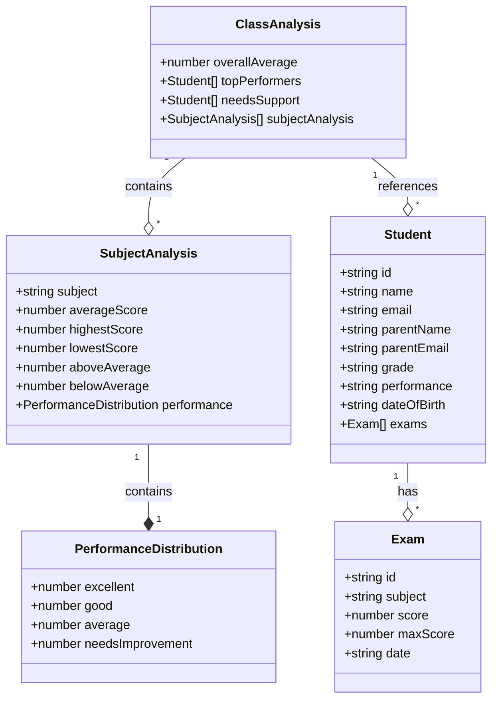
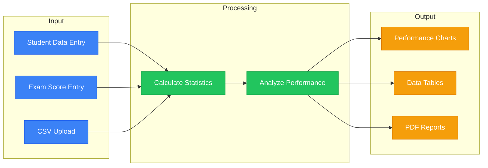

# Data Model

This document outlines the data structures used in InsightEd.

## Data Structures



## Data Flow



## Data Relationships

```mermaid
erDiagram
    STUDENT ||--o{ EXAM : has
    STUDENT {
        string id PK
        string name
        string email
        string parentName
        string parentEmail
        string grade
        string performance
        string dateOfBirth
    }
    
    EXAM {
        string id PK
        string subject
        number score
        number maxScore
        string date
        string studentId FK
    }
    
    ANALYSIS }|--|| CLASS : analyzesPerformanceOf
    ANALYSIS {
        string subject
        number averageScore
        number highestScore
        number lowestScore
    }
    
    CLASS {
        number overallAverage
        array topPerformers
        array needsSupport
    }
``` 