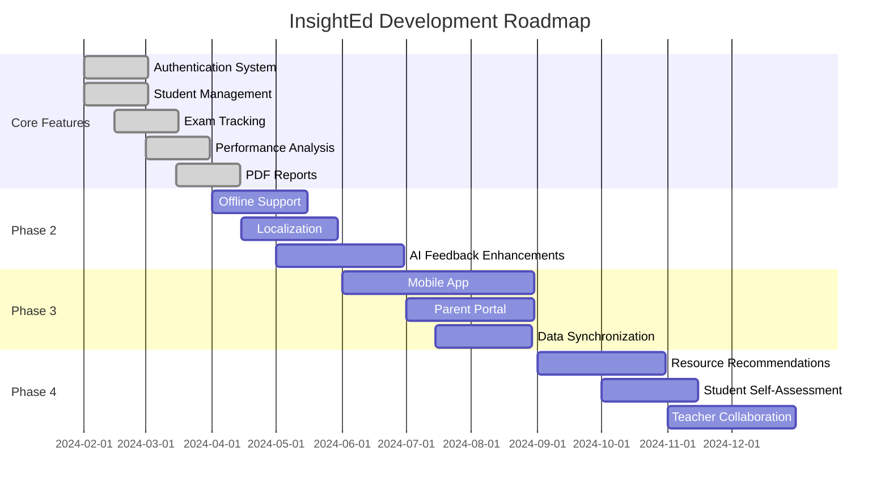
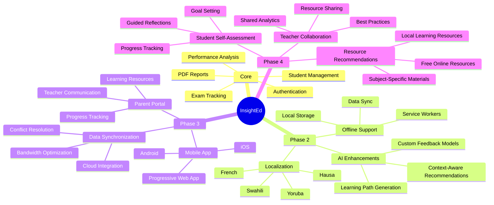
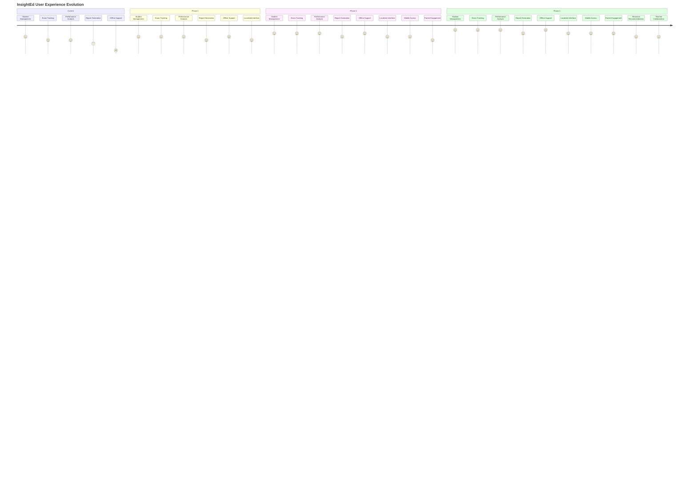

# Future Roadmap

This document outlines the planned future enhancements for the InsightEd application.

## Roadmap Timeline



## Feature Development Plan



## Architecture Evolution

```mermaid
graph TB
    subgraph Current Architecture
        direction TB
        UI1[React UI]
        State1[Client-Side State]
        LocalStorage1[Browser Storage]
    end
    
    subgraph Phase 2 Architecture
        direction TB
        UI2[React UI]
        State2[Client-Side State]
        LocalStorage2[Enhanced Offline Storage]
        AI[Enhanced AI Module]
    end
    
    subgraph Phase 3 Architecture
        direction TB
        UI3[Web & Mobile UI]
        State3[Client & Server State]
        Backend3[Backend API]
        DB3[Database]
        Sync[Sync Engine]
    end
    
    subgraph Phase 4 Architecture
        direction TB
        UI4[Multi-Platform UI]
        State4[Distributed State]
        Backend4[Microservices]
        DB4[Database]
        AI4[Advanced AI Engine]
        Analytics[Analytics Engine]
    end
    
    Current Architecture --> Phase 2 Architecture
    Phase 2 Architecture --> Phase 3 Architecture
    Phase 3 Architecture --> Phase 4 Architecture
    
    classDef current fill:#3b82f6,stroke:#2563eb,color:white;
    classDef phase2 fill:#22c55e,stroke:#16a34a,color:white;
    classDef phase3 fill:#f59e0b,stroke:#d97706,color:white;
    classDef phase4 fill:#ec4899,stroke:#db2777,color:white;
    
    class UI1,State1,LocalStorage1 current
    class UI2,State2,LocalStorage2,AI phase2
    class UI3,State3,Backend3,DB3,Sync phase3
    class UI4,State4,Backend4,DB4,AI4,Analytics phase4
```

## User Experience Evolution

