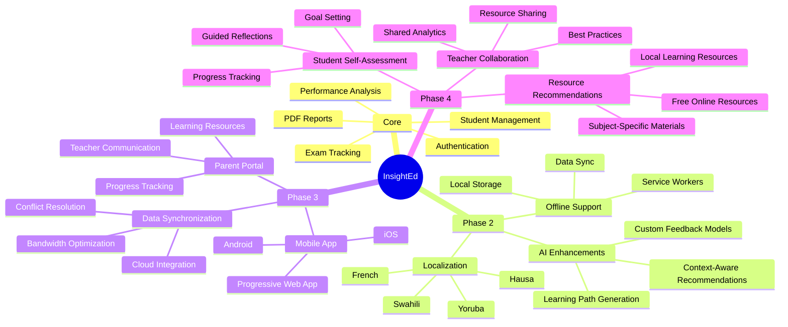
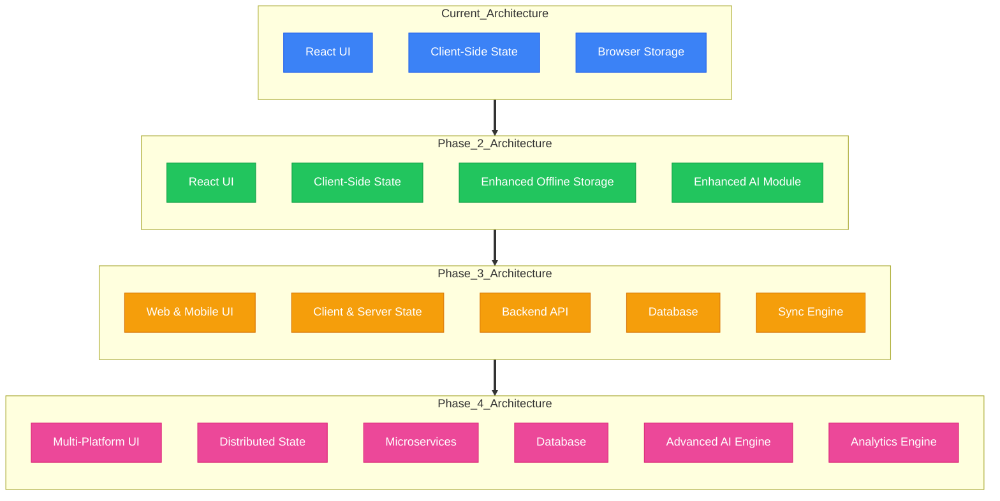

# Future Roadmap

This document outlines the planned future enhancements for the InsightEd application.

## Feature Development Plan

```mermaid
mindmap
    root((InsightEd))
        Core
            Authentication
            Student Management
            Exam Tracking
            Performance Analysis
            PDF Reports
        Phase 2
            Offline Support
                Local Storage
                Service Workers
                Data Sync
            Localization
                Swahili
                Yoruba
                Hausa
                French
            AI Enhancements
                Custom Feedback Models
                Context-Aware Recommendations
                Learning Path Generation
        Phase 3
            Mobile App
                iOS
                Android
                Progressive Web App
            Parent Portal
                Progress Tracking
                Teacher Communication
                Learning Resources
            Data Synchronization
                Cloud Integration
                Conflict Resolution
                Bandwidth Optimization
        Phase 4
            Resource Recommendations
                Subject-Specific Materials
                Free Online Resources
                Local Learning Resources
            Student Self-Assessment
                Guided Reflections
                Goal Setting
                Progress Tracking
            Teacher Collaboration
                Shared Analytics
                Best Practices
                Resource Sharing
```

## Architecture Evolution

```mermaid
graph TB
    subgraph Current_Architecture
        direction TB
        UI1[React UI]
        State1[Client-Side State]
        LocalStorage1[Browser Storage]
    end
    
    subgraph Phase_2_Architecture
        direction TB
        UI2[React UI]
        State2[Client-Side State]
        LocalStorage2[Enhanced Offline Storage]
        AI[Enhanced AI Module]
    end
    
    subgraph Phase_3_Architecture
        direction TB
        UI3[Web & Mobile UI]
        State3[Client & Server State]
        Backend3[Backend API]
        DB3[Database]
        Sync[Sync Engine]
    end
    
    subgraph Phase_4_Architecture
        direction TB
        UI4[Multi-Platform UI]
        State4[Distributed State]
        Backend4[Microservices]
        DB4[Database]
        AI4[Advanced AI Engine]
        Analytics[Analytics Engine]
    end
    
    Current_Architecture ==> Phase_2_Architecture
    Phase_2_Architecture ==> Phase_3_Architecture
    Phase_3_Architecture ==> Phase_4_Architecture
    
    classDef current fill:#3b82f6,stroke:#2563eb,color:white;
    classDef phase2 fill:#22c55e,stroke:#16a34a,color:white;
    classDef phase3 fill:#f59e0b,stroke:#d97706,color:white;
    classDef phase4 fill:#ec4899,stroke:#db2777,color:white;
    
    class UI1,State1,LocalStorage1 current
    class UI2,State2,LocalStorage2,AI phase2
    class UI3,State3,Backend3,DB3,Sync phase3
    class UI4,State4,Backend4,DB4,AI4,Analytics phase4
```