# InsightEd: Enhancing K-12 Education in Low-Resource Settings

> **Project Vision**: Bridging educational gaps through intelligent, offline-first AI solutions that empower teachers and transform learning outcomes in underserved communities.

## Executive Summary

InsightEd addresses the critical challenge of delivering quality K-12 education in low-resource environments through practical, teacher-centric AI solutions. Our approach focuses on offline-first technologies that augment rather than replace educators, ensuring sustainable impact in settings with limited connectivity and resources.

### Key Challenges Addressed


### Core Solutions
- **AI-Powered Exam Feedback Assistant**: Automated, personalized feedback generation
- **Localized Content Generator**: Curriculum-aligned materials in local languages  
- **Multilingual AI Tutor**: Teacher-mediated student support system
- **Progress Tracking System**: Early identification of at-risk students
- **Professional Development Hub**: Offline-first teacher training platform
- **Administrative Automation**: Streamlined attendance and record-keeping

---

## I. Bridging Gaps: AI's Potential in Low-Resource K-12 Education

### The Challenge Landscape

The challenge of delivering quality K-12 education in low-resource environments—spanning rural Africa, refugee camps, and under-funded districts—is immense. These settings are characterized by:


### The AI Opportunity

While technology is not a singular solution, **Artificial Intelligence (AI) and thoughtfully designed web applications present a visionary yet grounded opportunity to act as powerful equalizers**. The focus must be on:

#### 🎯 **Core Principles**
1. **Teacher-Centric Design**: Supporting and augmenting educators, not replacing them
2. **Offline-First Architecture**: Functioning without reliable internet connectivity
3. **Practical Impact**: Addressing real pain points with measurable outcomes
4. **Scalable Solutions**: Lightweight, cost-effective implementations

#### 🔄 **Paradigm Shift**
The narrative in EdTech for such contexts is evolving:
- **From**: Device deployment focus
- **To**: Effective and equitable technology utilization
- **Goal**: Drive tangible learning outcomes through intelligent support

### Success Factors


The success of AI hinges less on its intrinsic sophistication and more on its **appropriate integration into existing, often fragile, educational ecosystems**, where teacher mediation is paramount. These technologies can be critical enablers for:

- ✅ Scaling effective pedagogical practices
- ✅ Delivering personalized support where it's most needed
- ✅ Acting as "resource multipliers" in constrained environments
- ✅ Empowering teachers and fostering positive educational environments

---

*Next: Section II - Understanding Teacher Pain Points*

## II. Understanding the Frontlines: Top 5 Teacher Pain Points

> *"To design impactful solutions, it is crucial to understand the daily realities and pressing challenges faced by educators in these environments."*

The following pain points, substantiated by research, highlight the critical areas where targeted AI interventions can make a significant difference.

### Pain Points Overview


### 1. 📊 Assessment & Feedback Burden

**The Challenge**: Teachers in low-resource settings frequently grapple with the immense task of assessing student work and providing meaningful feedback, compounded by large class sizes.

#### Key Issues:
- ⏰ **Time Erosion**: Excessive marking reduces time for lesson planning and student interaction
- 📈 **Scale Problem**: Single teachers managing 40+ students makes individualized feedback nearly impossible
- 🎯 **Grade vs. Learning**: Pressure to assign grades overshadows practical skill development
- 🔄 **Feedback Quality**: Large workloads lead to superficial, less constructive feedback

#### Impact Metrics:
- **Class Sizes**: Often 40-50+ students per teacher (refugee settings can exceed this significantly)
- **Time Allocation**: Majority of non-teaching time spent on assessment rather than preparation
- **Feedback Delay**: Students receive feedback weeks after submission, reducing learning impact

> **AI Solution Opportunity**: AI-generated exam feedback reports can provide personalized, constructive feedback at scale while maintaining teacher oversight.

---

### 2. 🌍 Content Creation & Localization Demands

**The Challenge**: Educators struggle to find or create teaching materials that are relevant, culturally appropriate, curriculum-aligned, and available in local languages.

#### Key Issues:
- 🗣️ **Language Barriers**: Lack of Open Educational Resources (OER) in local languages
- 🎭 **Cultural Relevance**: Standardized curricula fail to reflect local contexts and student backgrounds
- 📚 **Resource Scarcity**: Limited access to diverse, high-quality educational materials
- ⚙️ **Curriculum Rigidity**: Inflexible standardized content doesn't cater to diverse learning needs

#### Current State:


> **AI Solution Opportunity**: Automated content adaptation, translation, and generation of curriculum-aligned materials in local languages.

---

### 3. 👥 Managing Large & Diverse Classrooms

**The Challenge**: High student-to-teacher ratios make individualized attention and differentiated instruction nearly impossible.

#### Critical Thresholds:
- **Optimal**: ≤27 students per teacher
- **Challenging**: 28-40 students per teacher  
- **Crisis Level**: 40+ students per teacher (common in low-resource settings)
- **Emergency**: 50+ students per teacher (refugee/crisis contexts)

#### Consequences:


> **AI Solution Opportunity**: Tools for classroom management, student grouping, and differentiated instruction support.

---

### 4. 📋 Administrative & Record-Keeping Workload

**The Challenge**: Educators are overwhelmed with non-teaching administrative tasks that consume valuable time and energy.

#### Administrative Burden Breakdown:
- 📝 **Attendance Logging**: Daily manual record-keeping
- 📊 **Student Records**: Maintaining comprehensive academic profiles
- 📈 **Report Generation**: Regular academic and behavioral reports
- 🏥 **Expanded Roles**: Psychosocial support in crisis contexts
- 📋 **Compliance Documentation**: Meeting regulatory requirements

#### Time Impact Analysis:


> **AI Solution Opportunity**: Automated attendance tracking, report generation, and administrative task streamlining.

---

### 5. 🎓 Limited Professional Development & Support

**The Challenge**: Teachers in remote or under-resourced areas lack access to continuous, high-quality professional development, peer collaboration, and expert mentorship.

#### Current TPD Limitations:
- 🏝️ **Geographic Isolation**: Limited access to training centers
- 💰 **Funding Constraints**: Insufficient budget for ongoing development
- ⏱️ **Short-term Focus**: Isolated workshops without sustained support
- 🤝 **Lack of Peer Networks**: Limited collaboration opportunities
- 📚 **Outdated Methods**: Training doesn't reflect modern pedagogical approaches

#### Effective TPD Requirements:


> **AI Solution Opportunity**: Offline-first professional development platform with AI-curated resources and peer collaboration tools.

---

### Interconnected Impact Analysis

These pain points don't exist in isolation—they create a **destructive cycle** that compounds educational challenges:


### The Resource Multiplier Approach

**AI tools can act as "resource multipliers" by:**
- 🤖 **Automating Routine Tasks**: Freeing up teacher time for high-impact activities
- 📚 **Providing Information Access**: Delivering knowledge and resources where human expertise is limited
- 🎯 **Offering Tailored Support**: Personalizing assistance based on specific needs
- 🔄 **Enabling Scalability**: Extending quality support to more students and teachers

---

### Summary: Pain Points Impact Table

| Pain Point | Direct Impact | Contributing Factors | Urgency Level |
|------------|---------------|---------------------|---------------|
| **Assessment Burden** | Reduced teaching quality, delayed feedback | Large classes, manual processes | 🔴 Critical |
| **Content Localization** | Student disengagement, comprehension issues | Language barriers, rigid curricula | 🟡 High |
| **Classroom Management** | Individual attention deficit, behavior issues | Teacher shortages, diverse needs | 🔴 Critical |
| **Administrative Load** | Time theft from teaching, teacher stress | Manual systems, expanded roles | 🟡 High |
| **Limited PD** | Stagnant practices, isolation | Geographic barriers, funding gaps | 🟠 Medium |

*Next: Section III - Solution Catalogue*

## III. Solution Catalogue: High-Impact AI & Web Applications

> *"These solutions are designed to address the identified teacher pain points, with a strong emphasis on teacher-mediated workflows, offline functionality, and suitability for low-resource K-12 settings."*

### Solutions Ecosystem Overview


### Solution Portfolio

| # | Solution Name | Elevator Pitch | Impact Level | Cost Level |
|---|---------------|----------------|--------------|------------|
| 1 | **AI-Powered Exam Feedback Assistant** | Empowers teachers to provide personalized, constructive feedback on student exams quickly, even in large classes and offline | 🔴 Very High | 🟡 Medium |
| 2 | **Localized Content & Lesson Plan Generator** | Helps teachers adapt OER or generate new, curriculum-aligned lesson plans and materials in local languages | 🟡 High | 🟠 Medium-High |
| 3 | **Multilingual AI Tutor & FAQ Chatbot** | Provides teachers with an AI assistant on a shared tablet to answer common student questions in multiple languages | 🟠 Medium-High | 🟢 Low-Medium |
| 4 | **Automated Student Progress Tracker** | Helps teachers log student performance and uses simple AI to highlight students needing extra support | 🟡 High | 🟢 Low |
| 5 | **Teacher Professional Development Hub** | An offline-first platform providing teachers access to training modules, best-practice resources, and peer sharing | 🟡 High | 🟢 Low |
| 6 | **Simple Attendance & Admin Automation** | A straightforward mobile app for shared tablets to quickly take attendance and manage basic admin tasks | 🟠 Medium | 🟢 Very Low |

---

### 1. 🎯 AI-Powered Exam Feedback Assistant

#### Overview
**Core Function**: Semi-automate the generation of constructive, personalized feedback on handwritten student exams

#### Technical Architecture


#### Key Features
- 📱 **Shared Tablet Interface**: Optimized for low-spec Android devices
- 🔍 **Hybrid OCR**: On-device Tesseract + optional cloud Vision API
- 🤖 **AI Feedback Engine**: Gemini Flash for cost-effective processing
- 👨‍🏫 **Human-in-the-Loop**: Teacher review and approval required
- 📄 **Print-Ready Output**: PDF reports for offline distribution
- 🔄 **Offline-First**: Core functionality without internet

#### Technology Stack
- **OCR**: Tesseract4Android, TensorFlow Lite OCR
- **AI Services**: Gemini 1.5 Flash, Vision API (optional)
- **PDF Generation**: OpenPDF library
- **Data Sync**: Firebase Offline Persistence
- **JSON Parsing**: Moshi library

---

### 2. 🌍 Localized Content & Lesson Plan Generator

#### Overview
**Core Function**: Adapt existing OER or generate new curriculum-aligned lesson plans and materials in local languages

#### Content Generation Pipeline


#### Key Features
- 🗣️ **Multilingual Support**: Content generation in local languages
- 📚 **OER Integration**: Leverages existing open educational resources
- 🎯 **Curriculum Alignment**: Matches local educational standards
- 🎨 **Cultural Adaptation**: Contextually relevant examples and scenarios
- 💾 **Offline Access**: Pre-cached content via Kolibri model
- 🔄 **Iterative Improvement**: Teacher feedback improves content quality

#### Technology Stack
- **AI Services**: Gemini API (content generation), Google TTS (audio)
- **Content Platform**: Learning Equality's Kolibri
- **Local LLMs**: GPT4All, Ollama for offline processing
- **Storage**: Local caching with Firebase sync

---

### 3. 🤖 Multilingual AI Tutor & FAQ Chatbot (Teacher-Mediated)

#### Overview
**Core Function**: Provide teachers with an AI assistant to answer common student questions and explain concepts in multiple languages

#### Interaction Flow


#### Key Features
- 🗣️ **Multilingual Responses**: Answers in student's preferred language
- 📚 **Knowledge Base**: Pre-compiled subject-specific information
- 👨‍🏫 **Teacher Mediation**: All responses reviewed before delivery
- 📊 **Usage Analytics**: Track common questions for curriculum insights
- 🔄 **Offline Operation**: On-device LLMs for basic queries
- 🎯 **Contextual Awareness**: Adapts to grade level and subject

#### Technology Stack
- **AI Services**: Gemini Nano, ML Kit GenAI APIs
- **Chatbot Framework**: Lightweight conversational AI
- **Local LLMs**: Wakoma/OfflineAI implementations
- **Storage**: Local knowledge bases with cloud sync

---

### 4. 📊 Automated Student Progress Tracker & At-Risk Identifier

#### Overview
**Core Function**: Help teachers log student performance and use AI to identify students needing extra support

#### Progress Tracking System


#### Key Features
- 📈 **Performance Tracking**: Comprehensive student progress monitoring
- 🚨 **Early Warning System**: AI-powered at-risk student identification
- 📊 **Visual Dashboards**: Easy-to-understand progress visualizations
- 🎯 **Intervention Suggestions**: Personalized support recommendations
- 📱 **Mobile-First**: Optimized for shared tablet input
- 🔄 **Offline Capability**: Local data storage with cloud sync

#### Technology Stack
- **Analytics**: Rule-based systems, TensorFlow Lite
- **Storage**: Firebase with offline persistence
- **Visualization**: Chart.js for progress displays
- **AI**: Basic pattern recognition algorithms

---

### 5. 🎓 Teacher Professional Development & Resource Hub

#### Overview
**Core Function**: Offline-first platform providing teachers access to training modules, best practices, and peer collaboration

#### Learning Ecosystem


#### Key Features
- 📚 **Comprehensive Library**: Curated educational content and resources
- 🤝 **Peer Networks**: Facilitate teacher collaboration and sharing
- 🎯 **Personalized Learning**: Adaptive content based on teacher needs
- 📱 **Offline Access**: Full functionality without internet connection
- 🏆 **Certification System**: Track progress and award achievements
- 🔄 **Content Curation**: AI-assisted resource recommendations

#### Technology Stack
- **Platform**: Learning Equality's Kolibri
- **AI Services**: Gemini API for content curation
- **Storage**: Firebase for user profiles and forums
- **Content**: Pre-loaded training materials and resources

---

### 6. 📋 Simple Attendance & Basic Admin Automation Tool

#### Overview
**Core Function**: Streamlined mobile app for quick attendance taking and basic administrative task management

#### Administrative Workflow


#### Key Features
- ⚡ **Quick Input**: Rapid attendance taking with minimal taps
- 📊 **Auto Reports**: Automated generation of administrative reports
- 🔄 **Offline Operation**: Full functionality without internet
- 📱 **Simple Interface**: Designed for low digital literacy
- 📈 **Data Analytics**: Basic insights on attendance patterns
- 🔄 **Seamless Sync**: Automatic data synchronization when online

#### Technology Stack
- **Framework**: Basic Android UI components
- **Storage**: Firebase with offline persistence
- **Analytics**: Simple statistical calculations
- **Sync**: Automated background synchronization

---

### Synergistic Integration

These solutions are designed to work together as an **interconnected support ecosystem**:


### Offline-First AI Paradigm

**Core Principle**: "Edge-intelligent, cloud-supported" rather than "cloud-native AI"

#### Architecture Benefits:
- 🔌 **Connectivity Independence**: Core functions work without internet
- 💰 **Cost Efficiency**: Reduced cloud service dependencies
- ⚡ **Performance**: Faster response times for local processing
- 🔒 **Data Privacy**: Sensitive information stays on-device
- 🌍 **Scalability**: Works in the most remote locations

#### Implementation Strategy:


---

*Next: Section IV - Deep Dive: AI-Powered Exam Feedback System*

## IV. Deep Dive: The AI-Powered Exam Feedback System

> *"The AI-Powered Exam Feedback System is designed as an anchor use case, directly addressing one of the most significant pain points for teachers: the burden of providing timely and constructive feedback."*

### A. Conceptual Overview & Teacher Workflow

#### System Goals
The primary goal of this system is to **semi-automate the generation of constructive, personalized feedback** on handwritten student exams, thereby acting as an intelligent assistant to the teacher.

#### Teacher-Centric Workflow

```mermaid
flowchart TD
    A[📝 Teacher Collects Handwritten Exams] --> B[📱 Scan Exam Pages with Shared Tablet]
    B --> C[🔍 OCR Converts Handwriting to Text]
    C --> D[✏️ Teacher Reviews & Corrects OCR Output]
    D --> E[🤖 AI Generates Feedback Draft]
    E --> F[👨‍🏫 Teacher Reviews & Edits Feedback]
    F --> G[📄 Generate PDF Reports]
    G --> H[🖨️ Print or Display Reports]
    
    subgraph "Human-in-the-Loop Control Points"
        D
        F
    end
    
    subgraph "Offline Capabilities"
        B
        C
        D
        F
        G
    end
    
    style D fill:#ffeaa7
    style F fill:#ffeaa7
    style E fill:#4ecdc4
```


#### Detailed Workflow Steps

1. **📝 Exam Collection**: Teacher collects handwritten student exams
2. **📱 Digital Scanning**: Using shared Android tablet, teacher scans each exam page with guided interface
3. **🔍 OCR Processing**: Application performs Optical Character Recognition (on-device or cloud-enhanced)
4. **✏️ Quality Review**: Teacher reviews transcribed text and makes corrections as needed
5. **🤖 AI Processing**: AI engine processes transcribed answers with contextual prompts
6. **👨‍🏫 Human Oversight**: Teacher reviews, edits, and approves AI-generated feedback
7. **📄 Report Generation**: System creates printable PDF reports for individual students or entire class
8. **🖨️ Distribution**: Reports printed for distribution or displayed on shared classroom screen

> **Key Principle**: This workflow is intentionally **teacher-mediated**, positioning AI as a supportive tool rather than a replacement, ensuring pedagogical expertise remains central.

---

### B. Data Flow Architecture: Scan → OCR → AI → PDF

#### Complete Data Flow Diagram

```mermaid
graph TD
    A[📷 Handwritten Exam Image] --> B[📱 Android Tablet App]
    B --> C{🔍 OCR Engine}
    
    C -->|On-Device Path| D[📱 Tesseract4Android]
    C -->|Cloud Path| E[☁️ Google Vision API]
    
    D --> F[📝 Raw Text String]
    E --> F
    
    F --> G[🧹 Text Pre-processing]
    G --> H[📋 Prompt Engineering Module]
    H --> I[🤖 AI Feedback Generation]
    
    I -->|Cloud Processing| J[☁️ Gemini API]
    I -->|Local Processing| K[📱 Local LLM]
    
    J --> L[📊 JSON Response]
    K --> L
    
    L --> M[🔧 JSON Parsing]
    M --> N[👨‍🏫 Teacher Review Interface]
    N --> O[✅ Final Approved Feedback]
    O --> P[📄 PDF Generation]
    P --> Q[💾 Local Storage]
    
    O -.->|When Online| R[☁️ Firebase Sync]
    G -.->|Metadata| R
    
    subgraph "Offline Core"
        B
        D
        F
        G
        H
        M
        N
        O
        P
        Q
    end
    
    subgraph "Cloud Enhancement"
        E
        J
        R
    end
    
    style D fill:#96ceb4
    style K fill:#96ceb4
    style J fill:#4ecdc4
    style E fill:#4ecdc4
```


#### Technical Implementation Details

| Stage | Component | Technology | Offline Capability |
|-------|-----------|------------|-------------------|
| **Image Capture** | Camera Interface | Android Camera2 API | ✅ Full |
| **OCR Processing** | Text Recognition | Tesseract4Android + Vision API | ✅ Primary (🔄 Enhanced) |
| **Text Cleaning** | Pre-processing | Custom algorithms | ✅ Full |
| **Prompt Engineering** | Context Building | Template system | ✅ Full |
| **AI Processing** | Feedback Generation | Gemini Flash + Local LLM | 🔄 Hybrid |
| **Data Parsing** | JSON Handling | Moshi library | ✅ Full |
| **PDF Creation** | Report Generation | OpenPDF library | ✅ Full |
| **Data Sync** | Cloud Storage | Firebase Offline | 🔄 Background |

---

### C. Prompt Engineering Strategy for Multilingual Feedback

#### Prompt Architecture Framework
```mermaid
mindmap
  root((Effective Prompt Design))
    Persona Definition
      Expert Teaching Assistant
      Encouraging Tone
      Grade-Appropriate Language
      Cultural Sensitivity
    Contextual Information
      Exam Question
      Student Answer
      Correct Answer/Rubric
      Learning Objectives
      Subject & Grade Level
    Task Specification
      Identify Strengths
      Areas for Improvement
      Specific Suggestions
      Actionable Feedback
    Output Format
      Structured JSON
      Multilingual Support
      Consistent Schema
      Teacher-Friendly Display
    Quality Assurance
      Few-Shot Examples
      Cultural Adaptation
      Iterative Refinement
      Teacher Feedback Loop
```

#### Sample Prompt Template

```json
{
  "role": "You are an expert, encouraging teaching assistant providing feedback to a [Grade 7] student on a [Mathematics] exam. Your primary goal is to help the student understand their mistakes constructively and learn from them, not merely to list errors. Maintain a supportive and positive tone throughout.",
  
  "context": {
    "exam_question": "[Question text]",
    "student_answer": "[OCR transcribed answer]",
    "correct_answer": "[Model answer/rubric]",
    "learning_objectives": "[Specific objectives]",
    "language": "[Target feedback language]",
    "cultural_context": "[Local pedagogical approach]"
  },
  
  "tasks": [
    "Identify 2-3 key strengths demonstrated in the student's answer",
    "Identify 2-3 main areas where the student can improve",
    "For each improvement area, provide one specific, actionable suggestion",
    "Provide feedback in [target language] using clear, simple, grammatically correct language appropriate for the grade level"
  ],
  
  "output_format": {
    "strengths": ["array of strength statements"],
    "areas_for_improvement": [
      {
        "area": "specific area needing work",
        "suggestion": "actionable improvement suggestion"
      }
    ],
    "overall_comment": "brief encouraging summary"
  }
}
```

#### Multilingual Considerations

**Language Adaptation Strategy**:
- 🗣️ **Beyond Translation**: Culturally and pedagogically appropriate phrasing
- 🎭 **Cultural Sensitivity**: Adapting directness levels and feedback styles
- 📚 **Local Context**: Using relevant examples and references
- 🔄 **Iterative Improvement**: Teacher feedback refines language models

**Quality Assurance Methods**:
```mermaid
graph LR
    A[Base Prompt] --> B[Few-Shot Examples]
    B --> C[Cultural Adaptation]
    C --> D[Teacher Testing]
    D --> E[Feedback Collection]
    E --> F[Prompt Refinement]
    F --> A
    
    style D fill:#ffeaa7
    style E fill:#ff6b6b
```

---

### D. UX Design for Shared Low-Spec Android Tablets

#### Design Principles for Low-Resource Contexts

```mermaid
graph TB
    subgraph "UX Design Priorities"
        A[Offline-First Functionality]
        B[Simplicity & Intuition]
        C[Resource Efficiency]
        D[Accessibility]
        E[Robustness]
    end
    
    A --> F[Core tasks work without internet]
    B --> G[Large buttons, minimal text, clear icons]
    C --> H[Optimized for low-spec hardware]
    D --> I[Low digital literacy support]
    E --> J[Graceful error handling]
    
    subgraph "Implementation Features"
        F
        G
        H
        I
        J
    end
    
    style A fill:#4ecdc4
    style B fill:#96ceb4
    style C fill:#45b7d1
    style D fill:#ffeaa7
    style E fill:#ff6b6b
```

#### Interface Design Specifications

**📱 Screen Layout Principles**:
- **Large Tap Targets**: Minimum 44px touch targets with adequate spacing
- **Clear Visual Hierarchy**: Important actions prominently displayed
- **Minimal Cognitive Load**: One primary action per screen
- **Progress Indicators**: Clear feedback for all operations
- **Error Recovery**: Simple, actionable error messages

**🔄 Shared Device Management**:
```mermaid
sequenceDiagram
    participant T1 as Teacher A
    participant D as Shared Tablet
    participant T2 as Teacher B
    
    T1->>D: Login/Start Session
    D->>T1: Load Teacher A's Data
    T1->>D: Complete Work
    T1->>D: Save & Logout
    D->>D: Secure Data Separation
    T2->>D: Login/Start Session
    D->>T2: Load Teacher B's Data
    
    Note over D: Data isolation ensures privacy
```

**💾 Data Management Features**:
- **Batch Organization**: Group exams by class, subject, date
- **Storage Indicators**: Clear local vs. synced data status
- **Cache Management**: Easy cleanup with data loss warnings
- **Session Persistence**: Auto-save to prevent data loss

#### Accessibility & Usability Features

| Feature Category | Implementation | Benefit |
|------------------|----------------|---------|
| **Visual Design** | High contrast, large fonts, clear icons | Better readability on low-quality screens |
| **Input Methods** | Dropdowns over typing, voice input options | Reduced typing burden |
| **Navigation** | Breadcrumbs, clear back buttons, task flows | Intuitive navigation for low digital literacy |
| **Feedback** | Immediate visual/audio confirmation | Clear action acknowledgment |
| **Error Handling** | Plain language, recovery suggestions | Reduced frustration and support needs |

---

### E. Cost Analysis & Financial Sustainability

#### Usage Assumptions for Cost Modeling

```mermaid
pie title "Monthly Usage Per Student"
    "Exam Processing (2 exams)" : 40
    "OCR Operations (4 pages)" : 30
    "AI Feedback Generation" : 20
    "Data Storage & Sync" : 10
```

**Base Assumptions**:
- 📊 **2 exams per student per month** (processed by system)
- 📄 **2 pages per exam average** (4 total pages/student/month)
- 🤖 **AI processing**: ~2,000 input + 500 output tokens per exam
- 🔍 **OCR**: Primarily on-device, 2% cloud processing for quality control

#### Detailed Cost Breakdown

**💰 Cost Per Student Per Month**:

| Service | Unit Cost | Usage | Monthly Cost |
|---------|-----------|-------|--------------|
| **Gemini 1.5 Flash** | $0.075/1M input tokens<br>$0.30/1M output tokens | 2 exams<br>(5,000 tokens total) | $0.0006 |
| **Vision API** | $1.50/1K images | 0.08 images | $0.00012 |
| **Firebase Storage** | Variable | Metadata & feedback | $0.02 |
| **Total** | | | **~$0.02072** |

#### Scaling Cost Projections

```mermaid
graph LR
    A[1K Students<br>$20.72/month] --> B[10K Students<br>$207.20/month]
    B --> C[100K Students<br>$2,072/month]
    
    subgraph "Cost Optimization Strategies"
        D[Free Tier Utilization]
        E[On-Device Processing]
        F[Efficient Prompt Engineering]
        G[Data Retention Policies]
    end
    
    A -.-> D
    B -.-> E
    C -.-> F
    C -.-> G
    
    style A fill:#96ceb4
    style B fill:#4ecdc4
    style C fill:#45b7d1
```

#### Cost-Performance Trade-offs

**🎯 Optimization Strategies**:

1. **Model Selection**: Gemini Flash vs. Pro vs. Nano
   - **Flash**: Best cost-performance balance
   - **Pro**: Higher accuracy, 4x cost
   - **Nano**: On-device, zero marginal cost

2. **OCR Approach**: On-device vs. Cloud
   - **On-device**: Zero cost, lower accuracy
   - **Cloud**: $0.0015/image, higher accuracy
   - **Hybrid**: 98% on-device, 2% cloud enhancement

3. **Human-in-the-Loop Benefits**:
   - **Cost Savings**: 80% accuracy sufficient with teacher review
   - **Quality Assurance**: Teacher expertise ensures pedagogical relevance
   - **Scalability**: Reduces need for perfect AI performance

#### Financial Sustainability Model

```mermaid
graph TD
    A[Initial Funding] --> B[Pilot Implementation]
    B --> C[Demonstrate Impact]
    C --> D[Scale to 10K Students]
    D --> E[Government/NGO Partnership]
    E --> F[Self-Sustaining Operations]
    
    G[Cost Reduction Strategies] --> H[On-Device AI Development]
    G --> I[Local Server Deployment]
    G --> J[Open Source Components]
    
    H --> F
    I --> F
    J --> F
    
    style F fill:#96ceb4
    style C fill:#ffeaa7
```

**Long-term Sustainability Factors**:
- 📈 **Economies of Scale**: Decreasing per-student costs at scale
- 🔧 **Technology Evolution**: More efficient on-device models
- 🤝 **Partnership Models**: Government and NGO cost-sharing
- 📊 **Impact Demonstration**: ROI through improved learning outcomes

---

*Next: Section V - The Funding Angle*

## V. The Funding Angle: A Bulletproof Rationale for Donors

> *"Investing in AI-powered educational tools for low-resource settings is an investment in human potential, teacher empowerment, and educational equity."*

### Investment Value Proposition

```mermaid
graph TB
    subgraph "Investment Returns"
        A[Human Capital Development]
        B[Educational Equity]
        C[Teacher Empowerment]
        D[Scalable Impact]
    end
    
    subgraph "Measurable Outcomes"
        E[Learning Improvements]
        F[Teacher Retention]
        G[Cost Efficiency]
        H[Sustainable Operations]
    end
    
    A --> E
    B --> E
    C --> F
    D --> G
    D --> H
    
    subgraph "Global Alignment"
        I[SDG 4: Quality Education]
        J[UNESCO Priorities]
        K[World Bank Initiatives]
    end
    
    E --> I
    F --> J
    G --> K
    
    style A fill:#4ecdc4
    style B fill:#96ceb4
    style C fill:#ffeaa7
    style D fill:#45b7d1
```

---

### A. Alignment with Sustainable Development Goals (SDG 4: Quality Education)

#### SDG 4 Target Mapping

```mermaid
graph LR
    subgraph "SDG 4 Targets"
        A[4.1: Quality Primary & Secondary Education]
        B[4.5: Equity and Inclusion]
        C[4.c: Qualified Teachers]
    end
    
    subgraph "InsightEd Solutions"
        D[AI Exam Feedback]
        E[Localized Content]
        F[Multilingual Tutor]
        G[Progress Tracking]
        H[Teacher PD Hub]
        I[Admin Automation]
    end
    
    A --> D
    A --> E
    A --> F
    B --> E
    B --> F
    B --> G
    C --> H
    C --> I
    C --> D
    
    style A fill:#ff6b6b
    style B fill:#4ecdc4
    style C fill:#ffeaa7
```

#### Direct SDG Impact Areas

**🎯 Target 4.1 (Quality Primary & Secondary Education)**:
- **Improved Feedback Quality**: AI-assisted personalized feedback enhances learning outcomes
- **Content Accessibility**: Localized materials make learning more relevant and effective
- **Learning Support**: Multilingual AI tutoring provides additional academic assistance

**🌍 Target 4.5 (Equity and Inclusion)**:
- **Language Inclusion**: Multilingual capabilities ensure no student is left behind due to language barriers
- **Geographic Equity**: Offline-first design reaches the most remote locations
- **Socioeconomic Access**: Shared device model reduces individual technology requirements

**👨‍🏫 Target 4.c (Qualified Teachers)**:
- **Professional Development**: Continuous, accessible training improves teacher effectiveness
- **Workload Reduction**: Administrative automation frees time for instruction
- **Skill Enhancement**: AI tools augment teacher capabilities without replacement

---

### B. Projected Learning-Outcome Gains

#### Evidence-Based Impact Projections

```mermaid
graph TD
    subgraph "Intervention Areas"
        A[Personalized Feedback]
        B[Localized Content]
        C[Teacher Efficiency]
        D[Student Engagement]
    end
    
    subgraph "Projected Outcomes (2-3 Years)"
        E[10-15% Score Improvement]
        F[50% Increase in Local Content Use]
        G[3-5 Hours Teacher Time Saved/Week]
        H[75% Early At-Risk Identification]
    end
    
    A --> E
    B --> F
    C --> G
    D --> H
    
    subgraph "Long-term Impact"
        I[Improved Literacy & Numeracy]
        J[Higher Student Retention]
        K[Better Teacher Retention]
        L[Reduced Achievement Gaps]
    end
    
    E --> I
    F --> J
    G --> K
    H --> L
    
    style E fill:#96ceb4
    style F fill:#4ecdc4
    style G fill:#ffeaa7
    style H fill:#45b7d1
```

#### Research-Backed Projections

**📈 Academic Performance**:
- **10-15% improvement** in subject-specific scores through personalized feedback
- **Enhanced conceptual understanding** via timely, constructive guidance
- **Reduced learning gaps** through early intervention systems

**🎯 Student Engagement**:
- **6x engagement boost** (similar to Brainly's Vision AI implementation)
- **Increased participation** through multilingual support
- **Better retention rates** via relevant, localized content

**👨‍🏫 Teacher Effectiveness**:
- **3-5 hours saved per week** through administrative automation
- **Improved job satisfaction** via reduced workload burden
- **Enhanced pedagogical skills** through accessible professional development

---

### C. Success Stories from Similar Pilots & Relevant EdTech

#### Proven Models & Case Studies

```mermaid
timeline
    title EdTech Success Stories in Low-Resource Settings
    
    section Offline-First Platforms
        Learning Equality's Kolibri : 220+ countries
                                   : Offline content delivery
                                   : Teacher support tools
    
    section Localized Content
        World Bank Africa Initiatives : Namibia computer/projector model
                                     : Kenya SMS-based learning
                                     : Local language emphasis
    
    section AI for Education
        Brainly Vision AI : 6x engagement increase
                         : Photo-based queries
                         : Student support scaling
    
    section Teacher Empowerment
        UNESCO Digital Learning : Teacher-centric approach
                               : Capacity building focus
                               : Sustainable adoption
```

#### Key Success Factors

**🌍 Offline-First Platforms**:
- **Learning Equality's Kolibri**: Successfully deployed in 220+ countries and territories
- **Proven Model**: Demonstrates feasibility of quality digital content without constant connectivity
- **Teacher Support**: Integrated tools for educator empowerment

**📚 Localized Digital Content**:
- **World Bank/UNESCO Emphasis**: Localized content and teacher training as key components
- **Creative Applications**: Basic technology (computer + projector, SMS) enhancing lessons
- **Cultural Relevance**: Local context significantly improves engagement

**🤖 AI for Student Support**:
- **Brainly Case Study**: 6x engagement boost with Vision AI-enabled photo queries
- **Teacher Efficiency**: AI tools reducing administrative burdens
- **Augmentation Approach**: AI supporting rather than replacing educators

---

### D. Financial Sustainability & ROI Analysis

#### Investment Tiers & Expected Returns

```mermaid
graph TD
    subgraph "Investment Phases"
        A[Pilot Phase: $50K-100K]
        B[Scale Phase: $500K-1M]
        C[Expansion Phase: $2M-5M]
    end
    
    subgraph "Student Reach"
        D[1K Students]
        E[10K Students]
        F[100K Students]
    end
    
    subgraph "Cost Per Student/Year"
        G[$250]
        H[$125]
        I[$62.50]
    end
    
    A --> D --> G
    B --> E --> H
    C --> F --> I
    
    subgraph "ROI Indicators"
        J[Learning Outcome Improvements]
        K[Teacher Retention Increases]
        L[Administrative Cost Reductions]
        M[Long-term Economic Impact]
    end
    
    G --> J
    H --> K
    I --> L
    L --> M
    
    style A fill:#ffeaa7
    style B fill:#4ecdc4
    style C fill:#96ceb4
```

#### Cost-Benefit Analysis

**💰 Direct Costs (Annual)**:
- **Technology**: $20-50 per student (hardware amortization + cloud services)
- **Training**: $100-200 per teacher (initial + ongoing professional development)
- **Support**: $10-25 per student (technical support + maintenance)

**📈 Quantifiable Benefits**:
- **Teacher Time Savings**: 3-5 hours/week = $500-1,000 annual value per teacher
- **Improved Learning Outcomes**: 10-15% score improvements = long-term economic gains
- **Reduced Dropout Rates**: Early intervention preventing student loss

**🎯 Return on Investment**:
- **Short-term (1-2 years)**: Teacher efficiency gains, reduced administrative costs
- **Medium-term (3-5 years)**: Improved learning outcomes, higher graduation rates
- **Long-term (5+ years)**: Economic development through improved human capital

---

### E. Donor Alignment & Partnership Opportunities

#### Funding Ecosystem Mapping

```mermaid
mindmap
  root((Funding Ecosystem))
    Multilateral Organizations
      World Bank
      UNESCO
      UNICEF
      Global Partnership for Education
    Bilateral Donors
      USAID
      DFID/FCDO
      GIZ
      SIDA
    Private Foundations
      Gates Foundation
      Mastercard Foundation
      Open Society Foundations
      Hewlett Foundation
    Corporate Partners
      Google.org
      Microsoft Education
      Amazon Future Engineer
      Meta Social Impact
    Impact Investors
      Acumen Academy
      Echidna Giving
      New Markets Impact Partners
      Omidyar Network
```

#### Strategic Partnership Models

**🤝 Government Partnerships**:
- **Ministry of Education Integration**: Curriculum alignment and policy support
- **Teacher Training Integration**: Embedding in existing professional development programs
- **Infrastructure Leverage**: Utilizing existing school networks and resources

**🌍 NGO Collaborations**:
- **Implementation Partners**: Local organizations with community trust and presence
- **Content Partners**: Organizations with curriculum and pedagogical expertise
- **Technology Partners**: Groups with technical implementation experience

**💼 Corporate Partnerships**:
- **Technology Providers**: Google, Microsoft for AI services and cloud infrastructure
- **Hardware Partners**: Tablet manufacturers for cost-effective device procurement
- **Connectivity Partners**: Telecommunications companies for internet access solutions

---

### F. Impact Measurement & Accountability Framework

#### Comprehensive M&E Strategy

```mermaid
graph TB
    subgraph "Input Indicators"
        A[Funding Received]
        B[Teachers Trained]
        C[Devices Deployed]
        D[Students Reached]
    end
    
    subgraph "Output Indicators"
        E[Exams Processed]
        F[Feedback Generated]
        G[Content Created]
        H[Admin Tasks Automated]
    end
    
    subgraph "Outcome Indicators"
        I[Learning Improvements]
        J[Teacher Satisfaction]
        K[Time Savings]
        L[Technology Adoption]
    end
    
    subgraph "Impact Indicators"
        M[Educational Equity]
        N[Teacher Retention]
        O[Student Progression]
        P[Community Engagement]
    end
    
    A --> E
    B --> F
    C --> G
    D --> H
    
    E --> I
    F --> J
    G --> K
    H --> L
    
    I --> M
    J --> N
    K --> O
    L --> P
    
    style I fill:#4ecdc4
    style J fill:#96ceb4
    style K fill:#ffeaa7
    style L fill:#45b7d1
```

#### Key Performance Indicators (KPIs)

| Category | Indicator | Target (Year 2) | Measurement Method |
|----------|-----------|-----------------|-------------------|
| **Learning Outcomes** | Subject score improvement | 10-15% increase | Pre/post assessments |
| **Teacher Efficiency** | Time saved per week | 3-5 hours | Time-tracking surveys |
| **Technology Adoption** | Active user rate | 80%+ teachers | Usage analytics |
| **Content Localization** | Local language materials | 50% increase | Content audit |
| **Student Engagement** | Participation rates | 25% increase | Classroom observations |
| **Teacher Satisfaction** | Job satisfaction scores | 20% improvement | Regular surveys |

#### Transparency & Reporting

**📊 Regular Reporting**:
- **Monthly**: Usage analytics and technical performance
- **Quarterly**: Teacher and student feedback surveys
- **Annually**: Comprehensive impact assessment and financial audit

**🔍 Independent Evaluation**:
- **External Evaluators**: Third-party assessment of impact and effectiveness
- **Academic Partnerships**: University research collaborations for rigorous evaluation
- **Peer Review**: Validation by education and technology experts

---

*Next: Section VI - Implementation & Risk Mitigation*

## VI. Charting the Course: Next Steps & Risk Mitigation

> *"A structured approach to implementation, beginning with a well-designed pilot program, is essential for success."*

### Implementation Roadmap Overview

```mermaid
gantt
    title InsightEd Implementation Timeline
    dateFormat  YYYY-MM-DD
    section Phase 1: Preparation
    Stakeholder Engagement    :prep1, 2024-01-01, 30d
    Needs Assessment         :prep2, after prep1, 30d
    Tool Contextualization   :prep3, after prep2, 45d
    Hardware Procurement     :prep4, after prep2, 30d
    Training Development     :prep5, after prep3, 30d
    
    section Phase 2: Setup
    Technical Setup          :setup1, after prep4, 15d
    Teacher Training         :setup2, after prep5, 30d
    Student Introduction     :setup3, after setup2, 15d
    
    section Phase 3: Implementation
    Active Deployment        :impl1, after setup3, 180d
    Ongoing Support          :impl2, after setup3, 180d
    Data Collection          :impl3, after setup3, 180d
    
    section Phase 4: Evaluation
    Data Analysis           :eval1, after impl1, 30d
    Stakeholder Review      :eval2, after eval1, 30d
    Strategy Refinement     :eval3, after eval2, 30d
    Final Reporting         :eval4, after eval3, 30d
```

---

### A. Pilot Program Implementation Framework

#### Phase 1: Preparation & Co-Design (Months 1-3)

**🤝 Stakeholder Engagement**
```mermaid
graph TB
    subgraph "Key Stakeholders"
        A[Teachers]
        B[School Administrators]
        C[Parents & Community]
        D[Local Education Authorities]
        E[Technology Partners]
    end
    
    subgraph "Engagement Activities"
        F[Workshops & Focus Groups]
        G[Needs Assessment Surveys]
        H[Co-design Sessions]
        I[Pilot School Selection]
    end
    
    A --> F
    B --> G
    C --> H
    D --> I
    E --> F
    
    subgraph "Outcomes"
        J[Buy-in & Ownership]
        K[Contextual Understanding]
        L[Tool Customization]
        M[Implementation Plan]
    end
    
    F --> J
    G --> K
    H --> L
    I --> M
```

**📋 Detailed Needs Assessment**:
- **Infrastructure Audit**: Existing technology, power, connectivity
- **Teacher Digital Literacy**: Current skills and training needs
- **Curriculum Mapping**: Local standards and learning objectives
- **Language Requirements**: Primary instruction languages and local dialects
- **Cultural Context**: Pedagogical approaches and community values

**🔧 Tool Contextualization**:
- **Prompt Engineering**: Multilingual feedback templates for local languages
- **Content Curation**: Relevant OER selection and adaptation
- **UI Localization**: Interface translation and cultural adaptation
- **Workflow Optimization**: Adapting processes to local teaching practices

#### Phase 2: Setup & Initial Training (Month 4)

**⚙️ Technical Infrastructure**
```mermaid
graph LR
    subgraph "Hardware Setup"
        A[Android Tablets]
        B[Local Server (Optional)]
        C[Printing Equipment]
        D[Charging Stations]
    end
    
    subgraph "Software Installation"
        E[InsightEd Apps]
        F[Offline Content]
        G[Security Configuration]
        H[Backup Systems]
    end
    
    subgraph "Network Configuration"
        I[WiFi Setup]
        J[Sync Scheduling]
        K[Bandwidth Management]
        L[Offline Fallbacks]
    end
    
    A --> E
    B --> F
    C --> G
    D --> H
    
    E --> I
    F --> J
    G --> K
    H --> L
```

**👨‍🏫 Comprehensive Teacher Training**:
- **Technical Skills**: Device operation, app navigation, troubleshooting
- **Pedagogical Integration**: Incorporating AI tools into lesson plans
- **Data Privacy**: Responsible use of student information
- **Quality Assurance**: Reviewing and improving AI-generated content

#### Phase 3: Classroom Implementation & Support (Months 5-10)

**📊 Continuous Monitoring & Support**
```mermaid
graph TD
    subgraph "Support Systems"
        A[On-site Technical Support]
        B[Remote Help Desk]
        C[Peer Teacher Networks]
        D[Regular Check-ins]
    end
    
    subgraph "Data Collection"
        E[Usage Analytics]
        F[Teacher Surveys]
        G[Student Feedback]
        H[Learning Assessments]
    end
    
    subgraph "Iterative Improvement"
        I[Weekly Adjustments]
        J[Monthly Reviews]
        K[Quarterly Updates]
        L[Continuous Training]
    end
    
    A --> E
    B --> F
    C --> G
    D --> H
    
    E --> I
    F --> J
    G --> K
    H --> L
```

#### Phase 4: Evaluation & Scaling Preparation (Months 11-12)

**📈 Comprehensive Impact Assessment**:
- **Quantitative Analysis**: Learning outcome improvements, usage statistics
- **Qualitative Evaluation**: Teacher interviews, focus groups, case studies
- **Cost-Effectiveness**: ROI analysis and sustainability planning
- **Scalability Assessment**: Lessons learned and replication guidelines

---

### B. Data Privacy & Security Framework (FERPA/GDPR Principles)

#### Privacy-by-Design Architecture

```mermaid
graph TB
    subgraph "Data Minimization"
        A[Collect Only Necessary Data]
        B[Anonymize When Possible]
        C[Local Processing Priority]
        D[Limited Cloud Transmission]
    end
    
    subgraph "Security Measures"
        E[Device-Level Encryption]
        F[Secure Data Transmission]
        G[Access Controls]
        H[Regular Security Audits]
    end
    
    subgraph "Consent & Transparency"
        I[Informed Consent Process]
        J[Clear Data Usage Policies]
        K[Opt-out Mechanisms]
        L[Regular Privacy Updates]
    end
    
    subgraph "Compliance Framework"
        M[FERPA Alignment]
        N[GDPR Principles]
        O[Local Regulations]
        P[International Standards]
    end
    
    A --> E
    B --> F
    C --> G
    D --> H
    
    E --> I
    F --> J
    G --> K
    H --> L
    
    I --> M
    J --> N
    K --> O
    L --> P
```

#### Data Protection Implementation

**🔒 Technical Safeguards**:
- **Encryption**: AES-256 for data at rest, TLS 1.3 for data in transit
- **Access Controls**: Role-based permissions, multi-factor authentication
- **Data Segregation**: Teacher-specific data isolation on shared devices
- **Audit Trails**: Comprehensive logging of all data access and modifications

**📋 Policy Framework**:
- **Data Retention**: Clear policies on how long data is stored
- **Deletion Procedures**: Secure data removal upon request or expiration
- **Breach Response**: Incident response plan and notification procedures
- **Third-Party Vetting**: Rigorous evaluation of all technology partners

**👨‍🏫 Teacher Training on Data Ethics**:
- **Privacy Awareness**: Understanding of student data sensitivity
- **Responsible Use**: Guidelines for appropriate AI tool usage
- **Incident Reporting**: Procedures for reporting potential privacy issues
- **Ongoing Education**: Regular updates on privacy best practices

---

### C. Connectivity Fallback Plans & Offline-First Resilience

#### Comprehensive Offline Strategy

```mermaid
graph TB
    subgraph "Core Offline Functions"
        A[Exam Scanning & OCR]
        B[AI Feedback Generation]
        C[PDF Report Creation]
        D[Student Progress Tracking]
        E[Content Access]
        F[Administrative Tasks]
    end
    
    subgraph "Local Storage Systems"
        G[Device Storage]
        H[Local Server Cache]
        I[Peer-to-Peer Sync]
        J[Removable Media Backup]
    end
    
    subgraph "Sync Strategies"
        K[Automatic Background Sync]
        L[Manual Sync Triggers]
        M[Batch Processing]
        N[Priority Queue Management]
    end
    
    subgraph "Degradation Handling"
        O[Feature Prioritization]
        P[Alternative Workflows]
        Q[Manual Fallbacks]
        R[Clear Status Indicators]
    end
    
    A --> G
    B --> H
    C --> I
    D --> J
    E --> G
    F --> H
    
    G --> K
    H --> L
    I --> M
    J --> N
    
    K --> O
    L --> P
    M --> Q
    N --> R
```

#### Resilience Planning

**🔌 Hardware Contingencies**:
- **Device Redundancy**: Spare tablets at district level
- **Repair Networks**: Local technician training and parts availability
- **Power Solutions**: Solar chargers, battery packs for extended use
- **Alternative Workflows**: Paper-based backup procedures for critical tasks

**📡 Connectivity Management**:
- **Opportunistic Sync**: Automatic data upload when connectivity detected
- **Bandwidth Optimization**: Compressed data transmission, delta syncing
- **Multiple Channels**: WiFi, cellular, satellite options where available
- **Offline Indicators**: Clear UI showing connection status and sync progress

**🔄 Operational Continuity**:
- **Teacher Cross-Training**: Multiple staff members familiar with systems
- **Documentation**: Comprehensive offline operation guides
- **Community Support**: Local technical support networks
- **Regular Drills**: Practice scenarios for extended offline periods

---

### D. Risk Assessment & Mitigation Strategies

#### Comprehensive Risk Matrix

```mermaid
graph TB
    subgraph "Technical Risks"
        A[Hardware Failure]
        B[Software Bugs]
        C[Connectivity Issues]
        D[Data Loss]
    end
    
    subgraph "Operational Risks"
        E[Teacher Resistance]
        F[Low Adoption]
        G[Inadequate Training]
        H[Support Gaps]
    end
    
    subgraph "Financial Risks"
        I[Cost Overruns]
        J[Funding Shortfalls]
        K[Sustainability Challenges]
        L[Currency Fluctuations]
    end
    
    subgraph "Contextual Risks"
        M[Political Instability]
        N[Cultural Resistance]
        O[Infrastructure Limitations]
        P[Regulatory Changes]
    end
    
    subgraph "Mitigation Strategies"
        Q[Redundancy & Backup]
        R[Change Management]
        S[Financial Planning]
        T[Stakeholder Engagement]
    end
    
    A --> Q
    B --> Q
    C --> Q
    D --> Q
    
    E --> R
    F --> R
    G --> R
    H --> R
    
    I --> S
    J --> S
    K --> S
    L --> S
    
    M --> T
    N --> T
    O --> T
    P --> T
```

#### Risk Mitigation Framework

| Risk Category | Specific Risk | Probability | Impact | Mitigation Strategy |
|---------------|---------------|-------------|--------|-------------------|
| **Technical** | Device theft/damage | Medium | High | Insurance, secure storage, tracking |
| **Technical** | Software compatibility | Low | Medium | Extensive testing, fallback versions |
| **Operational** | Teacher resistance | Medium | High | Co-design, training, incentives |
| **Operational** | Low digital literacy | High | Medium | Simplified UI, extensive training |
| **Financial** | Funding delays | Medium | High | Phased implementation, reserves |
| **Financial** | Cost escalation | Medium | Medium | Fixed-price contracts, contingency |
| **Contextual** | Policy changes | Low | High | Government partnerships, flexibility |
| **Contextual** | Infrastructure failure | Medium | Medium | Offline-first design, alternatives |

#### Adaptive Management Approach

**🔄 Continuous Monitoring**:
- **Early Warning Systems**: Indicators for potential issues
- **Regular Risk Reviews**: Monthly assessment and strategy updates
- **Stakeholder Feedback**: Ongoing input from all participants
- **Performance Tracking**: KPIs for risk mitigation effectiveness

**⚡ Rapid Response Protocols**:
- **Escalation Procedures**: Clear chains of responsibility
- **Emergency Contacts**: 24/7 support for critical issues
- **Alternative Plans**: Pre-developed contingency strategies
- **Communication Plans**: Stakeholder notification procedures

---

*Next: Section VII - Vision & Call to Action*

## VII. Empowering Every Learner: An Action-Oriented Vision

> *"The educational disparities in low-resource settings are profound, yet the opportunity to bridge these gaps through innovation is equally significant."*

### The Transformative Opportunity

```mermaid
graph TB
    subgraph "Current Reality"
        A[Educational Disparities]
        B[Teacher Overload]
        C[Limited Resources]
        D[Connectivity Challenges]
    end
    
    subgraph "InsightEd Solution"
        E[Teacher-Centric AI Tools]
        F[Offline-First Design]
        G[Multilingual Support]
        H[Cost-Effective Scaling]
    end
    
    subgraph "Transformed Future"
        I[Personalized Learning]
        J[Empowered Teachers]
        K[Educational Equity]
        L[Sustainable Impact]
    end
    
    A --> E
    B --> F
    C --> G
    D --> H
    
    E --> I
    F --> J
    G --> K
    H --> L
    
    style A fill:#ff6b6b
    style B fill:#ff6b6b
    style C fill:#ff6b6b
    style D fill:#ff6b6b
    style I fill:#96ceb4
    style J fill:#96ceb4
    style K fill:#96ceb4
    style L fill:#96ceb4
```

### Our Vision: AI as the Great Equalizer

Artificial Intelligence, when applied thoughtfully and practically, offers more than just futuristic promise—it provides a suite of tools available **today** that can genuinely transform teaching and learning. This comprehensive research has outlined a teacher-centric, offline-first approach to leveraging AI, designed to empower educators, enhance their effectiveness, and directly improve student outcomes.

#### 🎯 **Core Impact Areas**

**For Students**:
- 📚 **Personalized Learning Experiences**: Regardless of location or background
- 🗣️ **Multilingual Support**: Education in their native language
- ⚡ **Timely Feedback**: Constructive guidance when it matters most
- 🎯 **Early Intervention**: Identifying and addressing learning gaps quickly

**For Teachers**:
- ⏰ **Time Liberation**: 3-5 hours saved per week for actual teaching
- 🤖 **AI Assistance**: Intelligent support for routine tasks
- 📈 **Professional Growth**: Accessible, continuous development opportunities
- 😊 **Improved Well-being**: Reduced stress and increased job satisfaction

**For Communities**:
- 🌍 **Educational Equity**: Quality education reaching the most remote areas
- 💰 **Cost-Effective Solutions**: Maximum impact with minimal resources
- 🏗️ **Sustainable Development**: Building local capacity and expertise
- 🔄 **Scalable Model**: Replicable across diverse contexts

---

### The InsightEd Ecosystem: A Holistic Approach

```mermaid
mindmap
  root((InsightEd Ecosystem))
    Teacher Empowerment
      AI Exam Feedback Assistant
      Professional Development Hub
      Administrative Automation
      Multilingual Support
    Student Success
      Personalized Learning Paths
      Early Intervention Systems
      Engaging Content
      Progress Tracking
    System Sustainability
      Offline-First Architecture
      Cost-Effective Scaling
      Community Ownership
      Continuous Improvement
    Global Impact
      SDG 4 Alignment
      Educational Equity
      Economic Development
      Innovation Leadership
```

### Evidence-Based Impact Projections

Our proposed solutions are grounded in the realities of classrooms where resources are scarce and connectivity is a luxury, not a given. By focusing on alleviating teachers' most pressing pain points, these tools aim to free up their invaluable time, enabling them to focus on what they do best: inspiring and guiding young minds.

#### 📊 **Projected Outcomes (2-3 Year Timeline)**

```mermaid
graph LR
    subgraph "Year 1: Foundation"
        A[Pilot Implementation]
        B[Teacher Training]
        C[System Optimization]
    end
    
    subgraph "Year 2: Growth"
        D[10-15% Score Improvement]
        E[3-5 Hours Teacher Time Saved]
        F[75% At-Risk Student Identification]
    end
    
    subgraph "Year 3: Scale"
        G[50% Increase Local Content Use]
        H[Improved Teacher Retention]
        I[Sustainable Operations]
    end
    
    A --> D
    B --> E
    C --> F
    
    D --> G
    E --> H
    F --> I
    
    style D fill:#4ecdc4
    style E fill:#96ceb4
    style F fill:#ffeaa7
    style G fill:#45b7d1
    style H fill:#dda0dd
    style I fill:#98fb98
```

**The potential impact is substantial**:
- 🎓 **More personalized learning experiences** for students, regardless of their location or background
- 👨‍🏫 **Reduction in teacher workload** leading to improved well-being and retention
- 🌍 **A tangible step towards achieving quality education for all**, as envisioned by SDG 4
- 🤝 **Augmented human capabilities**, not replacement—making sophisticated pedagogical support accessible at scale

---

### Call to Action: Join the Movement

> *"This is not about replacing human educators but augmenting their capabilities, making sophisticated pedagogical support accessible at scale."*

#### 🤝 **Partnership Opportunities**

```mermaid
graph TB
    subgraph "Implementation Partners"
        A[Ministries of Education]
        B[Local NGOs]
        C[Teacher Training Institutes]
        D[Community Organizations]
    end
    
    subgraph "Technology Partners"
        E[Google.org]
        F[Microsoft Education]
        G[Hardware Manufacturers]
        H[Connectivity Providers]
    end
    
    subgraph "Funding Partners"
        I[World Bank]
        J[Gates Foundation]
        K[USAID]
        L[Private Foundations]
    end
    
    subgraph "Research Partners"
        M[Universities]
        N[Research Institutes]
        O[EdTech Organizations]
        P[Evaluation Specialists]
    end
    
    A --> Q[InsightEd Consortium]
    B --> Q
    C --> Q
    D --> Q
    E --> Q
    F --> Q
    G --> Q
    H --> Q
    I --> Q
    J --> Q
    K --> Q
    L --> Q
    M --> Q
    N --> Q
    O --> Q
    P --> Q
    
    style Q fill:#ff6b6b
```

#### 🚀 **Immediate Next Steps**

**For Donors & Funders**:
1. **💰 Pilot Funding**: $50K-100K for initial 1,000 student pilot
2. **📊 Impact Investment**: Support evidence-based scaling to 10K+ students
3. **🌍 Strategic Partnership**: Long-term commitment to educational transformation

**For Implementers**:
1. **🏫 Pilot School Selection**: Identify 3-5 schools for initial implementation
2. **👨‍🏫 Teacher Champion Network**: Recruit early adopter educators
3. **🔧 Technical Infrastructure**: Prepare hardware and connectivity solutions

**For Technology Partners**:
1. **🤖 AI Service Integration**: Optimize Gemini and Vision API for education
2. **📱 Hardware Partnerships**: Cost-effective tablet and device solutions
3. **☁️ Cloud Infrastructure**: Robust, scalable backend systems

**For Researchers**:
1. **📈 Impact Evaluation**: Rigorous measurement of learning outcomes
2. **🔬 Innovation Research**: Advancing AI in education methodologies
3. **📚 Knowledge Sharing**: Publishing findings for global benefit

---

### The Time is Now

```mermaid
timeline
    title The Urgency of Action
    
    section Current Crisis
        Educational Inequality : Millions of children lack quality education
        Teacher Shortage : Global deficit of qualified educators
        Technology Gap : Digital divide widens learning disparities
    
    section Available Solutions
        AI Technology : Mature, accessible AI tools ready for deployment
        Proven Models : Successful offline-first platforms exist
        Cost-Effective : Affordable implementation at scale
    
    section Window of Opportunity
        Global Commitment : SDG 4 targets require immediate action
        Technology Readiness : AI capabilities at inflection point
        Funding Availability : Increased EdTech investment interest
    
    section Call to Action
        Pilot Launch : Begin implementation in Q2 2024
        Scale Preparation : Expand to 10K students by 2025
        Global Impact : Transform education for millions by 2030
```

The journey requires **collaboration, innovation, and investment**. We invite partners, donors, and education stakeholders to join this mission. Together, we can build and deploy these AI-powered pathways, giving every child meaningful, personalized feedback and the chance to reach their full potential, irrespective of their zip code or connectivity.

**The time to act is now; the tools are within reach.** Let us harness them to create a more equitable and effective educational future for all.

---

### Get Involved: Contact & Next Steps

#### 📧 **Project Leadership**
- **Project Lead**: [Your Name]
- **Email**: [your.email@insighted.org]
- **LinkedIn**: [Your LinkedIn Profile]
- **Website**: [www.insighted.org]

#### 🤝 **Partnership Inquiries**
- **Funding Partners**: funding@insighted.org
- **Implementation Partners**: partnerships@insighted.org
- **Technology Partners**: tech@insighted.org
- **Research Collaborations**: research@insighted.org

#### 📅 **Immediate Opportunities**
1. **Pilot Program Participation**: Join our initial implementation cohort
2. **Advisory Board**: Provide strategic guidance and expertise
3. **Funding Partnership**: Support evidence-based educational innovation
4. **Technical Collaboration**: Contribute to open-source development

#### 🌍 **Global Network**
Join our growing community of educators, technologists, and changemakers committed to educational equity:
- **Monthly Webinars**: Latest developments and best practices
- **Quarterly Reports**: Impact data and lessons learned
- **Annual Conference**: Global gathering of InsightEd community
- **Open Source Community**: Contribute to tool development and improvement

---

### Final Commitment

**InsightEd represents more than a technological solution—it embodies a commitment to educational justice.** Every child deserves access to quality education, every teacher deserves the tools to succeed, and every community deserves the opportunity to thrive through learning.

By bridging the gap between cutting-edge AI technology and the urgent needs of underserved educational communities, we can create a future where:
- 🌟 **Every student receives personalized, timely feedback**
- 👨‍🏫 **Every teacher feels empowered and supported**
- 🌍 **Every community has access to quality education**
- 🚀 **Technology serves humanity's highest aspirations**

**The future of education is not just about what we can build—it's about what we choose to build together.**

*Join us in making this vision a reality.*

---

## Works Cited

### Education Systems & Challenges
- The Challenges and Potential of Education Systems in Developing Countries. (2025). Innovapath. https://www.innovapath.us/index.php/IN/article/view/35
- UNICEF. (2025). Learning Against the Odds. https://www.unicef.org/eap/media/3816/file/out%20of%20school.pdf
- Teacher Task Force. (2025). Teacher Wellbeing and the Shaping of Teacher Shortages in Crisis-Affected Contexts. https://teachertaskforce.org/sites/default/files/2025-01/TTF_Teacher%20wellbeing%20and%20the%20shaping%20of%20teacher%20shortages%20in%20crisis-affected%20contexts_Jan25.pdf

### Class Size & Learning Impact
- The Effect of School Size and Class Size on School Preparedness. (2025). PMC. https://pmc.ncbi.nlm.nih.gov/articles/PMC11002959/
- Are Smaller Class Sizes the Real Key to Better Student Outcomes? (2025). Reddit. https://www.reddit.com/r/Teachers/comments/1klwv79/are_smaller_class_sizes_the_real_key_to_better/

### AI in Education
- Transforming Rural and Underserved Schools with AI-Powered Education Solutions. (2025). ResearchGate. https://www.researchgate.net/publication/386894269_Transforming_Rural_and_Underserved_Schools_with_AI-Powered_Education_Solutions
- How AI Can Improve Education in Developing Countries. (2025). TSH Anywhere. https://www.tshanywhere.org/post/ai-improve-education-developing-countries
- 5 AI Case Studies in Education. (2025). VKTR. https://www.vktr.com/ai-disruption/5-ai-case-studies-in-education/

### Technical Implementation
#### AI & Machine Learning
- Gemini Nano | AI. (2025). Android Developers. https://developer.android.com/ai/gemini-nano
- Use Cases of TensorFlow Lite For On-Device ML Capabilities. (2025). Tops Info Solutions. https://www.topsinfosolutions.com/blog/tensorflow-lite-on-device-ml-use-cases/
- Wakoma/OfflineAI: Local/Offline Machine Learning Resources. (2025). GitHub. https://github.com/Wakoma/OfflineAI

#### Offline Capabilities
- Access Data Offline | Firestore. (2025). Firebase. https://firebase.google.com/docs/firestore/manage-data/enable-offline
- Enabling Offline Capabilities on Android. (2025). Firebase. https://firebase.google.com/docs/database/android/offline-capabilities
- State Management for Offline-First Web Applications. (2025). PixelFreeStudio. https://blog.pixelfreestudio.com/state-management-for-offline-first-web-applications/

#### OCR & Image Processing
- Implementing OCR in Android and iOS Apps with Open-Source SDKs. (2025). Transloadit. https://transloadit.com/devtips/implementing-ocr-in-android-and-ios-apps-with-open-source-sdks/
- Tesseract4Android. (2025). GitHub. https://github.com/adaptech-cz/Tesseract4Android
- OCR_TFlite: Quantized Results from Tensorflow Model. (2025). GitHub. https://github.com/aghasaadmohammad/OCR_TFlite

### UX/UI Design
- Accessible Technology for All: A Content Analysis of UX Design. (2025). USFCA Repository. https://repository.usfca.edu/cgi/viewcontent.cgi?article=1709&context=diss
- 5 Ways to Design Impactful Mobile User Experiences. (2025). IxDF. https://www.interaction-design.org/literature/article/master-mobile-experiences-from-ixdf-course
- Design for Education: Optimizing edTech Products for Learning. (2025). Backpack Interactive. https://backpackinteractive.com/insights/ux-design-for-education/

### Privacy & Security
- Data Privacy in Education Through FERPA and GDPR Adherence. (2025). Hurix Digital. https://www.hurix.com/blogs/data-privacy-in-education-through-ferpa-and-gdpr-adherence/
- Data Security: K-12 and Higher Education. (2025). Student Privacy. https://studentprivacy.ed.gov/data-security-k-12-and-higher-education
- Federated Learning for Children's Data. (2025). UNICEF Innocenti. https://www.unicef.org/innocenti/stories/federated-learning-childrens-data

### Policy & Implementation
- UNESCO. (2025). AI Competency Framework for Teachers. https://www.unesco.org/en/articles/ai-competency-framework-teachers
- Essential Conditions for Effective Tech Use in Schools. (2025). ISTE. https://iste.org/essential-conditions-for-effective-tech-use-in-schools
- Resource Guide for Supporting Technology in Education. (2025). IES. https://ies.ed.gov/sites/default/files/migrated/rel/regions/northwest/pdf/Resource_Guide_for_Supporting_Technology_in_Education.pdf
