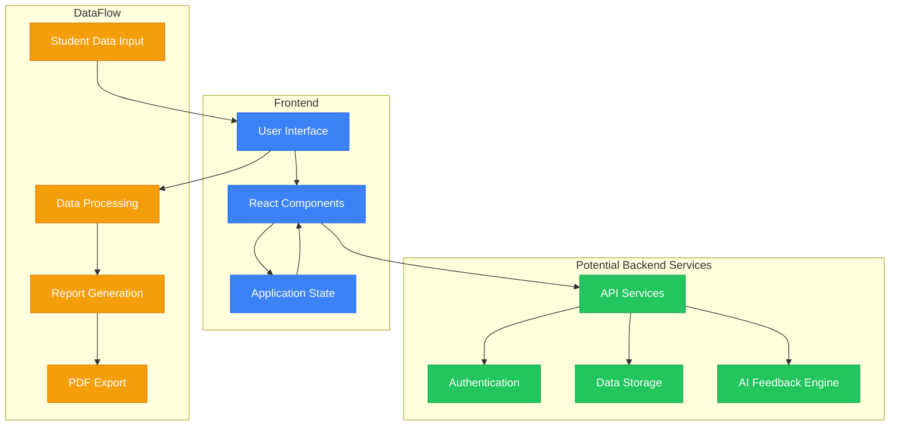

# InsightEd System Overview

InsightEd is an AI-powered feedback system designed to help teachers generate personalized learning insights for students in underprivileged educational environments. This document provides a high-level overview of the system architecture and components.

## System Architecture

## Key Components

- **User Interface**: React-based frontend with shadcn/ui components
- **State Management**: Client-side state using React hooks
- **Data Input**: Manual entry and CSV upload for student scores
- **Analysis Engine**: Score processing and visualization tools
- **Feedback Generation**: AI-powered personalized feedback for students
- **Export Functionality**: PDF report generation for sharing with students and parents

## Technology Stack

- **Frontend**: React, TypeScript, Vite, Tailwind CSS
- **UI Components**: shadcn/ui, Radix UI primitives
- **Charts**: Recharts for data visualization
- **PDF Generation**: jsPDF
- **Authentication**: Local authentication mechanism
- **Data Storage**: Client-side storage (demo data) 