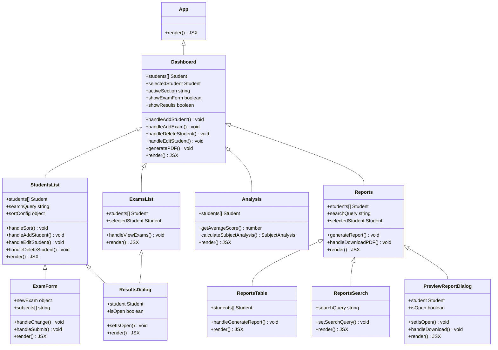
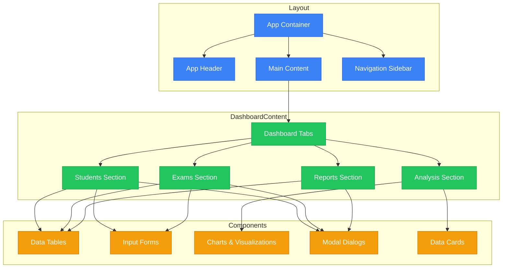

# UI Components

This document outlines the UI components used in the InsightEd application and their relationships.

## Component Structure

```mermaid
classDiagram
    class App {
        +render() JSX
    }
    
    class Dashboard {
        +students[] Student
        +selectedStudent Student
        +activeSection string
        +showExamForm boolean
        +showResults boolean
        +handleAddStudent() void
        +handleAddExam() void
        +handleDeleteStudent() void
        +handleEditStudent() void
        +generatePDF() void
        +render() JSX
    }
    
    class StudentsList {
        +students[] Student
        +searchQuery string
        +sortConfig object
        +handleSort() void
        +handleAddStudent() void
        +handleEditStudent() void
        +handleDeleteStudent() void
        +render() JSX
    }
    
    class ExamsList {
        +students[] Student
        +selectedStudent Student
        +handleViewExams() void
        +render() JSX
    }
    
    class Analysis {
        +students[] Student
        +getAverageScore() number
        +calculateSubjectAnalysis() SubjectAnalysis
        +render() JSX
    }
    
    class Reports {
        +students[] Student
        +searchQuery string
        +selectedStudent Student
        +generateReport() void
        +handleDownloadPDF() void
        +render() JSX
    }
    
    class ExamForm {
        +newExam object
        +subjects[] string
        +handleChange() void
        +handleSubmit() void
        +render() JSX
    }
    
    class ResultsDialog {
        +student Student
        +isOpen boolean
        +setIsOpen() void
        +render() JSX
    }
    
    class ReportsTable {
        +students[] Student
        +handleGenerateReport() void
        +render() JSX
    }
    
    class ReportsSearch {
        +searchQuery string
        +setSearchQuery() void
        +render() JSX
    }
    
    class PreviewReportDialog {
        +student Student
        +isOpen boolean
        +setIsOpen() void
        +handleDownload() void
        +render() JSX
    }
    
    App <|-- Dashboard
    Dashboard <|-- StudentsList
    Dashboard <|-- ExamsList
    Dashboard <|-- Analysis
    Dashboard <|-- Reports
    
    StudentsList <|-- ExamForm
    StudentsList <|-- ResultsDialog
    
    ExamsList <|-- ResultsDialog
    
    Reports <|-- ReportsTable
    Reports <|-- ReportsSearch
    Reports <|-- PreviewReportDialog
```

## UI Layout Diagram

```mermaid
graph TD
    subgraph Layout
        AppContainer[App Container]
        Header[App Header]
        MainContent[Main Content]
        Sidebar[Navigation Sidebar]
    end
    
    subgraph DashboardContent
        Tabs[Dashboard Tabs]
        StudentSection[Students Section]
        ExamsSection[Exams Section]
        AnalysisSection[Analysis Section]
        ReportsSection[Reports Section]
    end
    
    subgraph Components
        Tables[Data Tables]
        Forms[Input Forms]
        Charts[Charts & Visualizations]
        Dialogs[Modal Dialogs]
        Cards[Data Cards]
    end
    
    AppContainer --> Header
    AppContainer --> Sidebar
    AppContainer --> MainContent
    
    MainContent --> Tabs
    
    Tabs --> StudentSection
    Tabs --> ExamsSection
    Tabs --> AnalysisSection
    Tabs --> ReportsSection
    
    StudentSection --> Tables
    StudentSection --> Forms
    StudentSection --> Dialogs
    
    ExamsSection --> Tables
    ExamsSection --> Forms
    ExamsSection --> Dialogs
    
    AnalysisSection --> Charts
    AnalysisSection --> Cards
    
    ReportsSection --> Tables
    ReportsSection --> Dialogs
    
    classDef container fill:#3b82f6,stroke:#2563eb,color:white;
    classDef section fill:#22c55e,stroke:#16a34a,color:white;
    classDef component fill:#f59e0b,stroke:#d97706,color:white;
    
    class AppContainer,Header,MainContent,Sidebar container
    class Tabs,StudentSection,ExamsSection,AnalysisSection,ReportsSection section
    class Tables,Forms,Charts,Dialogs,Cards component
```

## Dashboard UI Components

```mermaid
flowchart TB
    subgraph Dashboard
        direction TB
        NavTabs[Navigation Tabs]
        
        subgraph StudentsTab
            direction TB
            StudentSearchBar[Search Input]
            AddStudentButton[Add Student Button]
            StudentTable[Students Table]
            StudentPagination[Pagination]
        end
        
        subgraph ExamsTab
            direction TB
            ExamStudentList[Student Selection]
            ExamTable[Exams Table]
            AddExamButton[Add Exam Button]
        end
        
        subgraph AnalysisTab
            direction TB
            MetricsCards[Overall Metrics Cards]
            PerformanceChart[Performance Distribution Chart]
            SubjectCards[Subject Analysis Cards]
        end
        
        subgraph ReportsTab
            direction TB
            ReportSearchBar[Search Input]
            ReportTable[Students Table]
            GenerateReportButton[Generate Report Button]
        end
    end
    
    NavTabs --> StudentsTab
    NavTabs --> ExamsTab
    NavTabs --> AnalysisTab
    NavTabs --> ReportsTab
    
    classDef container fill:#3b82f6,stroke:#2563eb,color:white;
    classDef section fill:#22c55e,stroke:#16a34a,color:white;
    classDef component fill:#f59e0b,stroke:#d97706,color:white;
    classDef input fill:#ec4899,stroke:#db2777,color:white;
    
    class Dashboard,NavTabs container
    class StudentsTab,ExamsTab,AnalysisTab,ReportsTab section
    class StudentTable,ExamTable,PerformanceChart,SubjectCards,ReportTable,MetricsCards component
    class StudentSearchBar,AddStudentButton,ExamStudentList,AddExamButton,ReportSearchBar,GenerateReportButton input
``` 