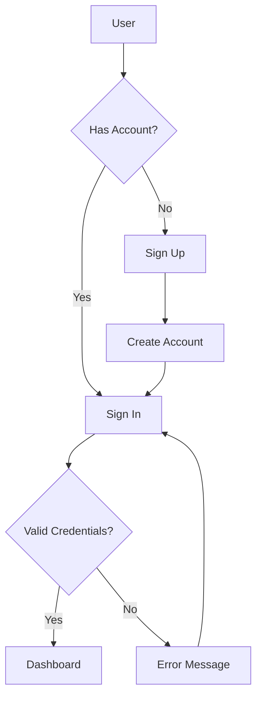
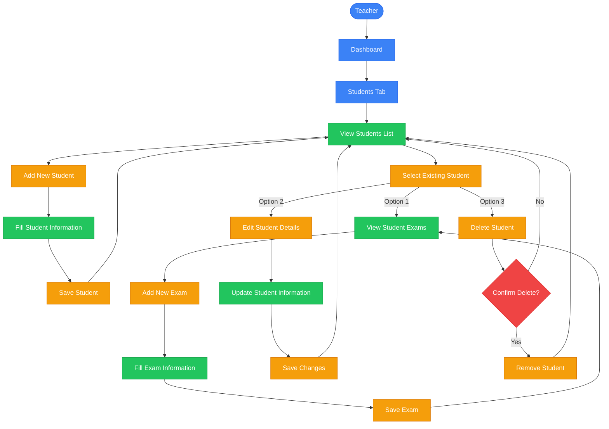
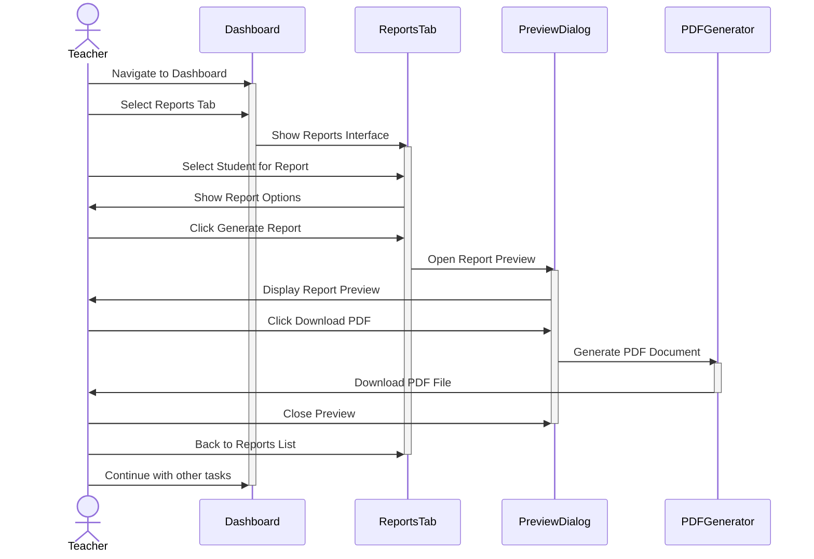
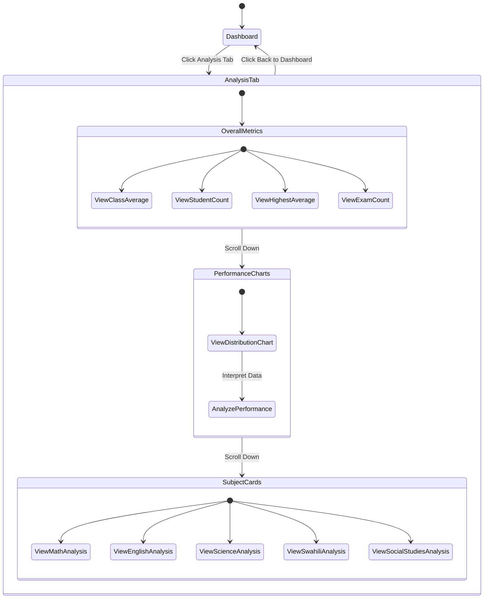

# User Flows

This document outlines the different user flows in the InsightEd application.

## Authentication Flow

## Student Management Flow

## Report Generation Flow

## Class Analysis Flow

